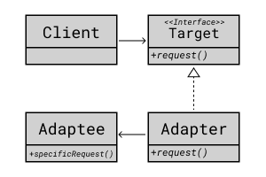

## Adapter Pattern

호환성이 없는 인터페이스를 사용 가능하도록 변환해주는 패턴

Client는 Adaptee를 사용하기 위해 Target이라는 인터페이스를 사용한다.
인터페이스의 내용은 Adapter에서 구현하고 Adapter에서는 Adaptee를 사용한다.

### 시나리오

판테온은 리메이크 전 스킬이 SpearShot, AegisOfZeonia, HeartseekerStrike, GrandSkyfall이였다.
그런데 리메이크 되면서 CometSpear, ShieldVault, AegisAssault, GrandStarfall로 바뀌었다.
리메이크 전에 구현한 기능들을 리메이크 후에 사용할 수 있도록 디자인하라.