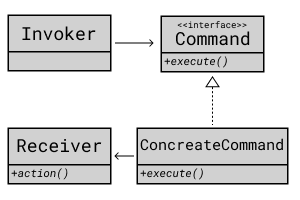

## Command Pattern

이벤트 발생 시 실행되는 기능잉 다양하면서 변경이 필요한 경우
이벤트를 발생시키는 클래스를 변경하지 않고 재사용하고자 할 때 유용한다.

### 시나리오

소환사 주문에는 점화(Ignite), 점멸(Flash) 등등이 있다.
주로 소환사 주문은 키보드 d, f 키로 지정되는데
사용자의 설정에 따라 해당 소환사 주문이 발동하도록
커맨드 패턴을 활용하여 디자인 해보자. 
