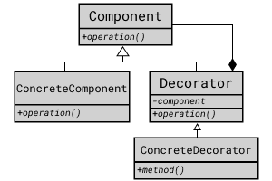

## Decorator Pattern

여러가지 기능을 추가하거나 조합할 수 있는 경우 Decorator 클래스로 정의한 후 
필요한 Decorator 객체를 조합해서 사용하는 설계 방법이다. 

### 시나리오
 
롤에서 챔피언은 여러가지 버프 효과를 받을 수 있다.
대표적으로 블루(Crest of Insight), 레드(Crest of Cinders), 바론 버프(Hand of Baron) 등이 있는데 해당 효과들은
동시에 여러개를 가질 수도 있다.
챔피언의 버프 상태를 데코레이터 패턴으로 디자인 해 보자.