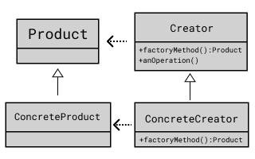

## Factory Method Pattern

객체의 생성 코드를 별도의 클래스/메서드로 분리하여
객체 생성의 변화에 대비하는데 유용

### 시나리오

롤에서 AI와 봇전을 하면 입문(Intro), 초보(Beginner), 중급(Intermediate)으로 
난이도를 설정해 봇을 생성할 수 있다. 원하는 난이도로
설정해 봇 객체를 만들도록 디자인 해보자.

 
