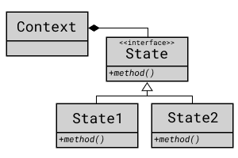

## State Pattern

객체가 특정 상태에 따라 행위를 달리하도록 만들 경우,
상태를 객체화하여 상태가 행동을 정하도록 하는 패턴

Strategy Pattern과 비슷하다.

### 시나리오

롤에서 챔피언의 상태는 여러가지가 있다.
그 중 침묵(Silence) 상태에서는 스킬을 사용하지 못하고,
실명(Blind) 상태에서는 평타 공격을 빗나가게 만든다.
이를 State Pattern으로 디자인해보자.