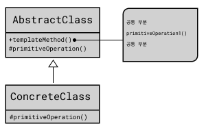

## Template Method Pattern

전체적인 흐름은 동일하면서 
부분적으로 다른 메서드의 
코드 중복을 최소화하는 디자인 패턴

동일한 부분은 상위 클래스에서 정의하고
확장/변화가 필요한 부분만 서브 클래스에서 구현하도록 한다.

### 시나리오

정글 아이템 중에 파랑 강타(Stalker's Blade)와 빨강강타(Skirmisher's Saber)가 있다.
기본적으로 추가되는 효과는 똑같지만
사용하는 강타의 효과는 다르다.
이를 템플릿 메서드 패턴을 이용하여 디자인 해보자. 
